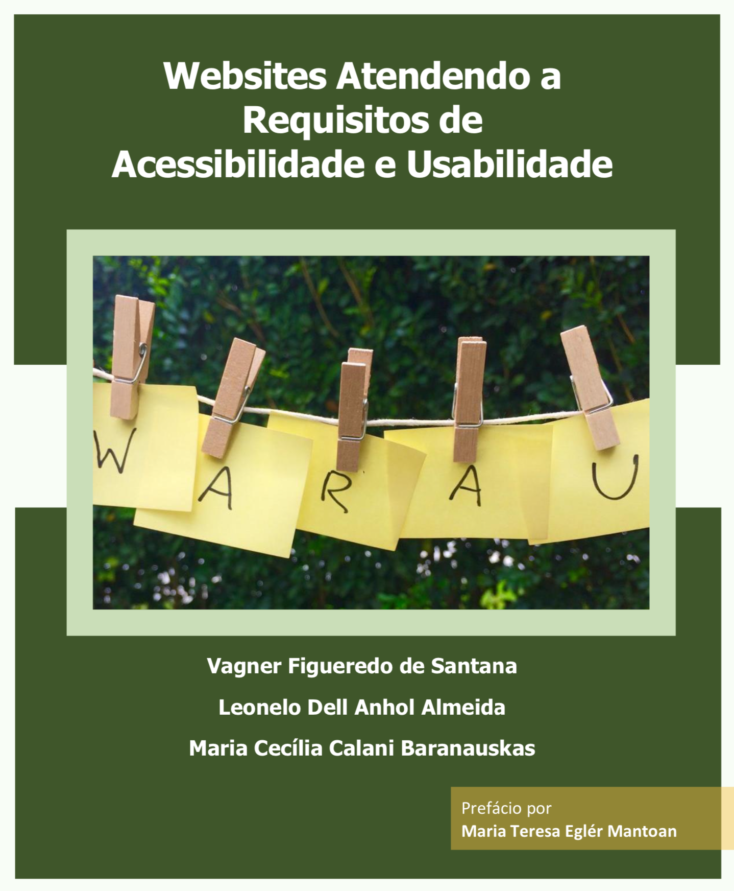

# Websites Atendendo a Requisitos de Acessibilidade e Usabilidade

  

**Autores:** Vagner Figueredo de Santana, Leonelo Dell Anhol Almeida, Maria Cecília Calani Baranauskas

Este repositório disponibiliza o conteúdo do livro **Websites Atendendo a Requisitos de Acessibilidade e Usabilidade**.

- Versão web: https://santanavagner.github.io/warau/
- Disponível também no Leanpub: https://leanpub.com/warau/

## Como citar

| Formato | Citação | 
| :--- | :--- | 
| Texto | Websites Atendendo a Requisitos de Acessibilidade e Usabilidade. 2018. Santana, Vagner Figueredo de; Almeida, Leonelo Dell Anhol; Baranauskas, Maria Cecília Calani. Leanpub. https://leanpub.com/warau |
| Bibtex | \@book{Santana2018, &emsp;title={WARAU: Websites Atendendo a Requisitos de Acessibilidade e Usabilidade}, &emsp;author={Santana, Vagner Figueredo and Almeida, Leonelo Dell Anhol and Baranauskas, Maria Cecília Calani}, &emsp;year={2018}, &emsp;publisher = {Leanpub}, &emsp;isbn = {978-85-907039-1-4} } |
  

  

