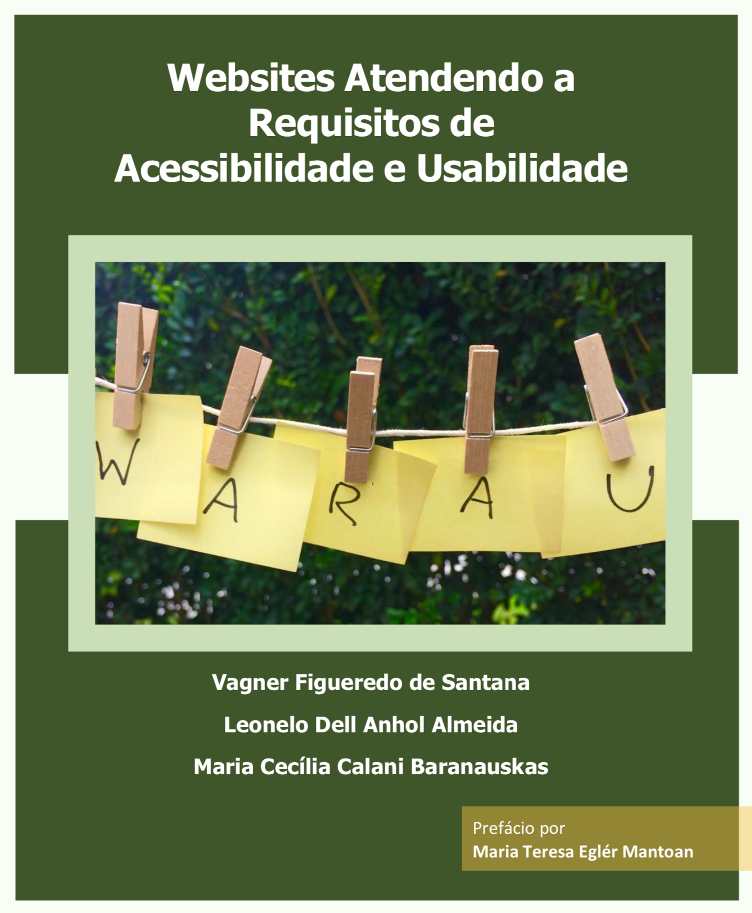

# WARAU: Websites Atendendo a Requisitos de Acessibilidade e Usabilidade

  

**Autores:** 
- [Vagner Figueredo de Santana](http://lattes.cnpq.br/0796625901609802)
- [Leonelo Dell Anhol Almeida](http://lattes.cnpq.br/4597216569899545)
- [Maria Cecília Calani Baranauskas](http://lattes.cnpq.br/1750385790843118)

**Prefácio por:** Profa. Maria Teresa Eglér Mantoan

Este livro é voltado para mantenedores de websites (desenvolvedores, designers e redatores) com conhecimentos básicos sobre tecnologias Web (e.g., HTML, CSS, JavaScript) e que queiram aprender a construir websites válidos, acessíveis e usáveis, a partir de exemplos simples e práticos.

- Versão web: https://santanavagner.github.io/warau/
- Disponível também no Leanpub: https://leanpub.com/warau/

## Como citar

| Formato | Citação | 
| :--- | :--- | 
| Texto | Websites Atendendo a Requisitos de Acessibilidade e Usabilidade. 2018. Santana, Vagner Figueredo de; Almeida, Leonelo Dell Anhol; Baranauskas, Maria Cecília Calani. ISBN: 978-85-907039-1-4. Leanpub. https://leanpub.com/warau |
| Bibtex | \@book{Santana2018, &emsp;title={WARAU: Websites Atendendo a Requisitos de Acessibilidade e Usabilidade}, &emsp;author={Santana, Vagner Figueredo and Almeida, Leonelo Dell Anhol and Baranauskas, Maria Cecília Calani}, &emsp;year={2018}, &emsp;publisher = {Leanpub}, &emsp;isbn = {978-85-907039-1-4} } |
  

  

